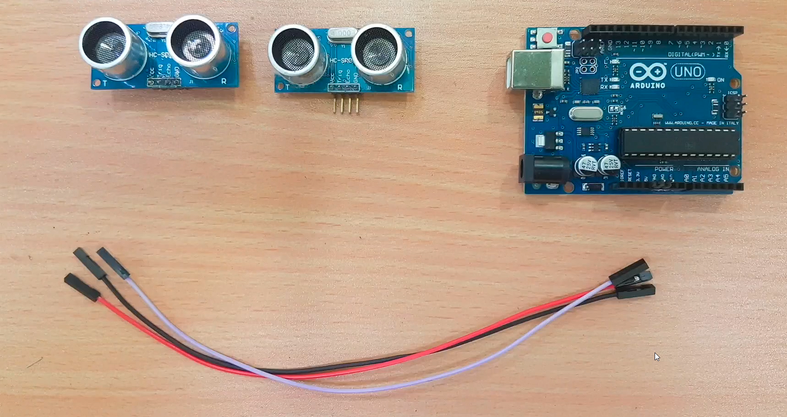
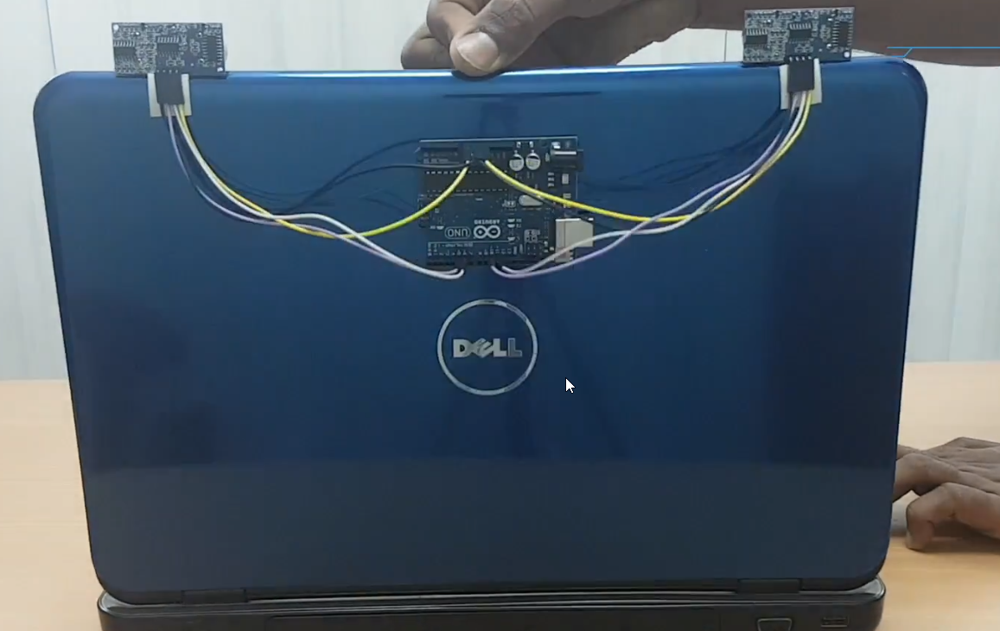
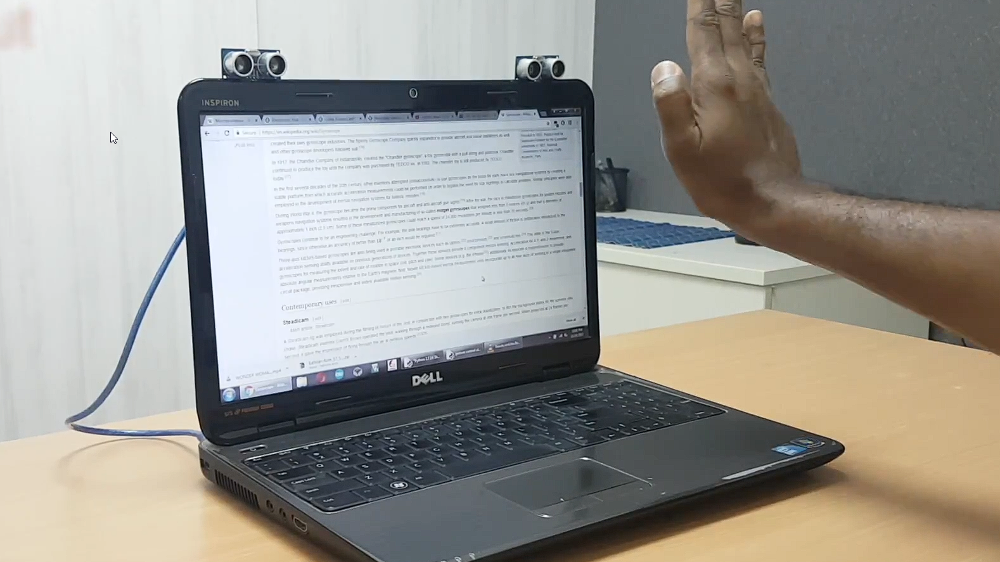

# Gesture-control-using-arduino

You might have seen Hand Gesture Controlled Robots, where the motion of a robot is controlled by the gestures of the hand. Another interesting project based on a similar principle is an Arduino based Hand Gesture Control of your computer or laptop.

Human Machine Interface or HMI is a system comprising of hardware and software that helps in communication and exchange of information between the user (human operator) and the machine.

We normally use LED Indicators, Switches, Touch Screens and LCD Displays as a part of HMI devices. Another way to communicate with machines like Robots or Computers is with the help of Hand Gestures.

Instead of using a keyboard, mouse or joystick, we can use our hand gestures to control certain functions of a computer like play/pause a video, move left/right in a photo slide show, scroll up/down in a web page and many more.

In this project, we have implemented a simple Arduino based hand gesture control where you can control few functions of your web browser like switching between tabs, scrolling up and down in web pages, shift between tasks (applications), play or pause a video and increase or decrease the volume (in VLC Player) with the help of hand gestures.

# Components Required
- Arduino UNO x 1  [Buy Here]
- Ultrasonic Sensors x 2  
- USB Cable (for Arduino) 
- Few Connecting Wires  
- A Laptop with internet connection 



# Circuit Diagram
The circuit diagram of Arduino part of the project is shown in the following image. It consists of an Arduino UNO board and two Ultrasonic Sensors and you can power up all these components from the laptop’s USB Port.



# Gestures
- Gesture 1: Place your hand in front of the Right Ultrasonic Sensor at a distance (between 15CM to 35CM) for a small duration and move your hand away from the sensor. This gesture will Scroll Down the Web Page or Decrease the Volume.

- Gesture 2: Place your hand in front of the Right Ultrasonic Sensor at a distance (between 15CM to 35CM) for a small duration and move your hand towards the sensor. This gesture will Scroll up the Web Page or Increase the Volume.

- Gesture 3: Swipe your hand in front of the Right Ultrasonic Sensor. This gesture will move to the Next Tab.

- Gesture 4: Swipe your hand in front of the Left Ultrasonic Sensor. This gesture will move to the Previous Tab or Play/Pause the Video.

- Gesture 5: Swipe your hand across both the sensors (Left Sensor first). This action will Switch between Tasks.



## Python Programming for the Project

make sure you have python installed on your system, and pip commang is working properly

then,
```
pip install pyautogui
```

then run the python code and connect the arduino.
